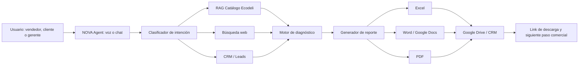

# NOVA Commercial Intelligence System para Hotelería Ecodeli

NOVA es un copiloto comercial para soluciones de higiene institucional en hotelería. El objetivo del proyecto es convertir conversaciones de vendedores, clientes o gerentes internos en diagnósticos comerciales, investigación de prospectos, recomendaciones de bundles y reportes descargables en Excel, Word o PDF.

## Objetivo de negocio

Crear un asesor comercial operativo que permita a Ecodeli:

- Diagnosticar oportunidades por zona operativa hotelera.
- Detectar GAPs de producto en cuentas nuevas o cautivas.
- Recomendar bundles con claves de catálogo.
- Investigar prospectos hoteleros en internet cuando se solicite.
- Generar reportes comerciales en tiempo real.
- Guardar leads, seguimientos y oportunidades en una base consultable.

## Base de conocimiento

El agente se alimenta del Catálogo Vertical Sector Hotelero de Ecodeli, que organiza el portafolio por áreas operativas como habitaciones, amenidades, baños públicos, control de aromas, químicos, Sistema Nova Clean, carros camarista, botes y contenedores, Sistema Microclean, restaurante, albercas, equipos, artículos de limpieza, bolsas/EPP y venta cruzada.

Datos comerciales integrados en el discurso:

- Cobertura nacional con más de 50 sucursales.
- Más de 7,000 productos.
- Entrega máxima de 48 horas.
- SmartOne: reducción de consumo hasta 40%.
- Microburst: hasta 180 días sin reposición.
- Microclean: hasta 90% menos agua frente a trapeado convencional.
- Mopa de microfibra: hasta 500 lavadas.
- Gravity Control: 4 L equivalen a 120 botellas de 1 L.
- HAGOMAT: desinfección a 80 °C y hasta 50% de ahorro de agua frente a lavado manual.
- Xpressnap: hasta 25% menos merma de servilletas.

## Arquitectura recomendada



## Stack recomendado

- ElevenLabs Agent o interfaz web para conversación.
- n8n como orquestador operativo.
- OpenAI o modelo LLM para razonamiento comercial.
- Base RAG del catálogo Ecodeli.
- Google Sheets, Airtable, HubSpot o Zoho como CRM ligero.
- Google Docs/Sheets para plantillas editables.
- Conversión automática a PDF.
- SerpAPI, Bing Search API, Tavily o Perplexity API para investigación web.

## Estructura del proyecto

```text
nova-commercial-intelligence/
├── README.md
├── prompts/
│   ├── system-prompt-nova.md
│   └── first-message.md
├── schemas/
│   ├── lead-schema.json
│   └── report-schema.json
├── templates/
│   ├── excel-report-fields.md
│   └── executive-report-template.md
└── workflows/
    └── n8n-blueprint.md
```

## Flujo operativo mínimo viable

1. NOVA pregunta si el usuario es vendedor, cliente/prospecto o gerente interno.
2. Captura nombre completo, empresa, ciudad, tipo de hotel, número de habitaciones y objetivo.
3. Diagnostica GAPs por zona operativa.
4. Recomienda bundles con claves y argumentos de ahorro, eficiencia, imagen y experiencia del huésped.
5. Si se pide investigación web, busca información pública del prospecto.
6. Separa datos confirmados, estimados y pendientes de validar.
7. Genera documento en Excel, Word o PDF.
8. Guarda lead y reporte en CRM/Drive.
9. Devuelve link de descarga y siguiente acción comercial.

## Estado

Proyecto inicial creado para convertir el agente NOVA en un sistema comercial accionable, documentable y escalable.